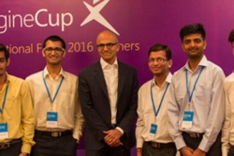
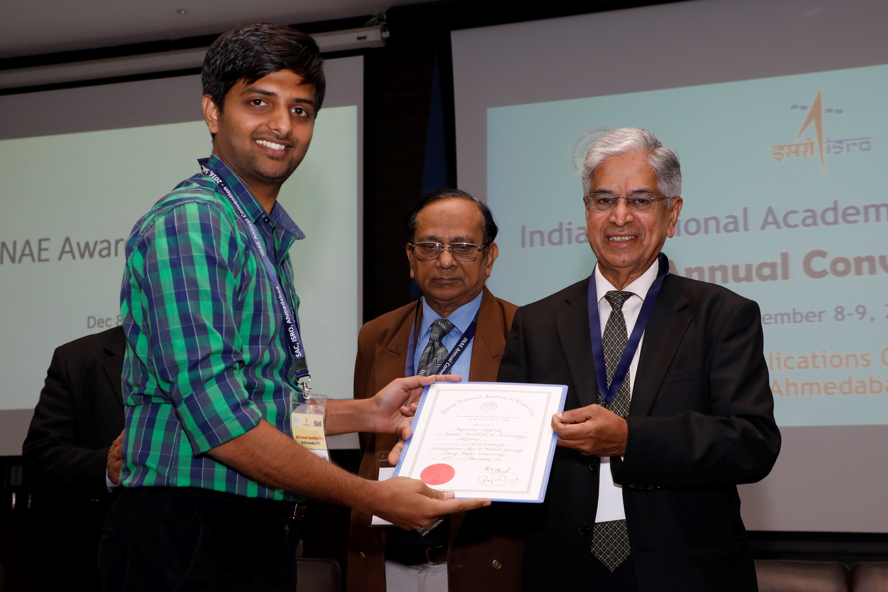
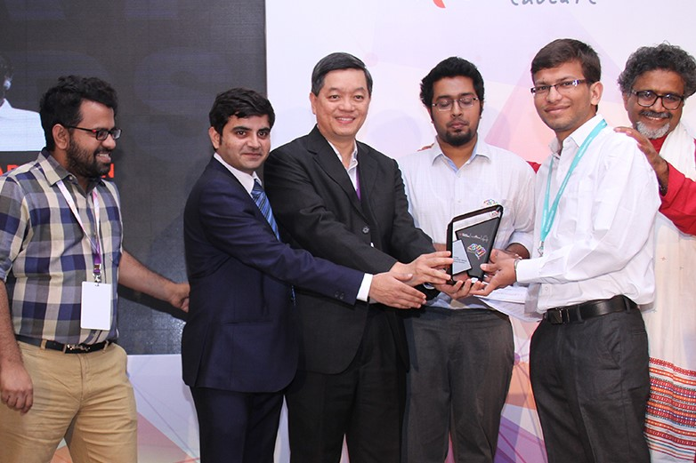


  You can also find my articles on <u><a href="{{author.googlescholar}}">my Google Scholar profile</a>.</u>





  


# Honours and Awards

| Won the [Microsoft Imagine Cup 2016, India](https://news.microsoft.com/en-in/microsoft-announces-india-winners-of-the-14th-edition-of-imagine-cup/)  in the World Citizenship category, to address social cleanliness through the novel app [SpotGarbage](https://www.youtube.com/watch?v=cTkCsz5C8zs).    |                   &nbsp;&nbsp;&nbsp;&nbsp;&nbsp;&nbsp;&nbsp;&nbsp;&nbsp;&nbsp;&nbsp;&nbsp;&nbsp;&nbsp;&nbsp;&nbsp;&nbsp;&nbsp;&nbsp;&nbsp;&nbsp;&nbsp;&nbsp;&nbsp;&nbsp;&nbsp;&nbsp;&nbsp;&nbsp;&nbsp;&nbsp;&nbsp;&nbsp;&nbsp;&nbsp;&nbsp;&nbsp;&nbsp;&nbsp;&nbsp;&nbsp;&nbsp;&nbsp;&nbsp;&nbsp;&nbsp;&nbsp;&nbsp;&nbsp;&nbsp;         |
| Winner of [Innovative Student Project Award](http://inae.in/innovative-student-projects-award/) at Undergraduate Level 2016 by the Indian National Academy of Engineering for the best undergraduate thesis project in Computer Science in India.    |               |
| Young Innovator Award by [MeltingPot2020 Innovation Summit](http://www.meltingpot2020.com/MP2016.html) held at Delhi in 2016. |           |
