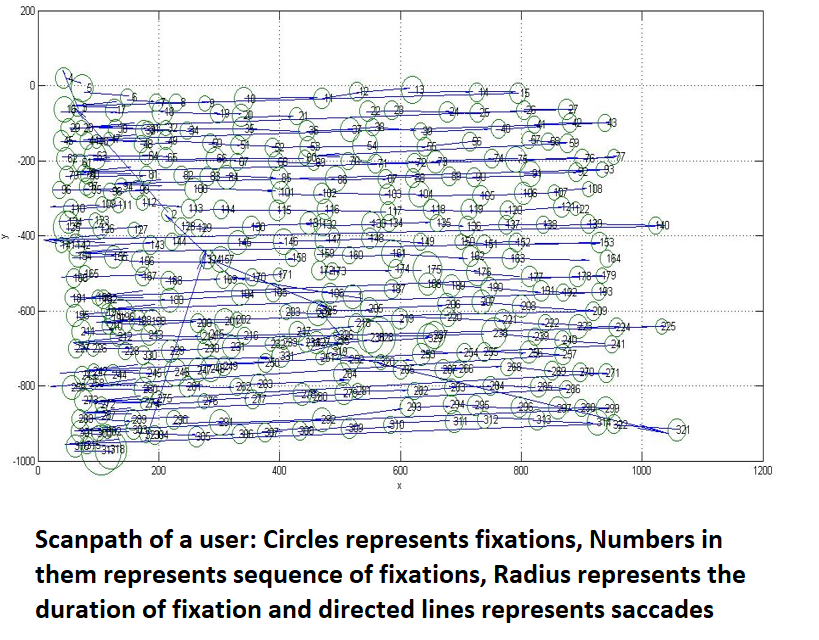

Guide: Prof. C.E. Veni Madhavan,&ensp;Indian Institute of Science, Bangalore

* Aggregated eye tracking data to convert scanpaths into weighted undirected graph
* Idea was to make area of interests (AOI’s) as nodes and saccades as weighted edges
* Combined all the saccades between a pair of AOI’s to convert it into weighted edge between those pairs of AOI’s
* The weight of an edge is defined by the fixation time of fixations and saccade length within a pair of AOI.
* 
